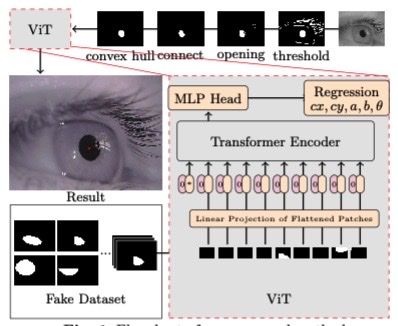

# fakepupil

Pupil Center Localization Transformer Train without Truly Pupil

We propose a method to generate a fake pupil dataset by using the shape characteristics of the pupil and use ViT training without marking the data set. 

